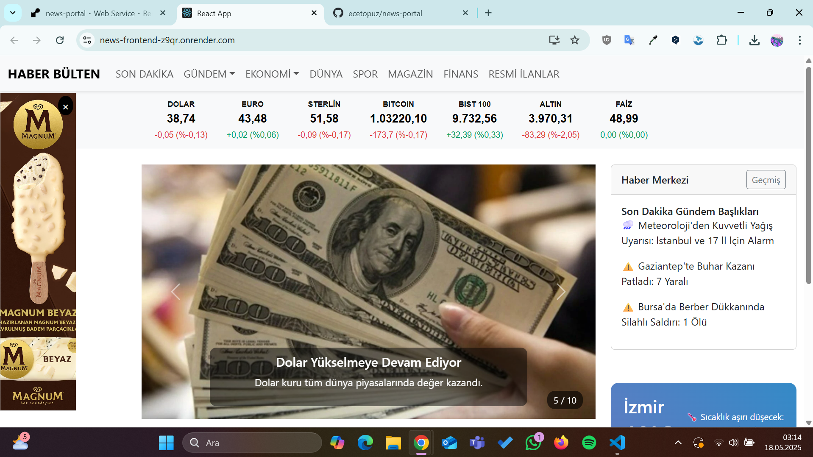
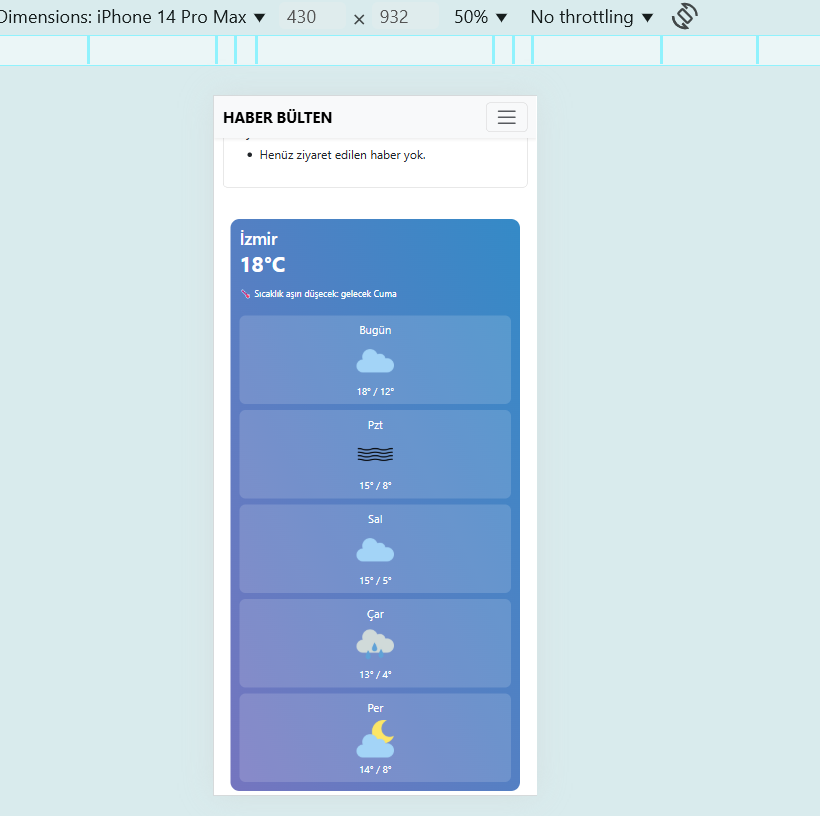
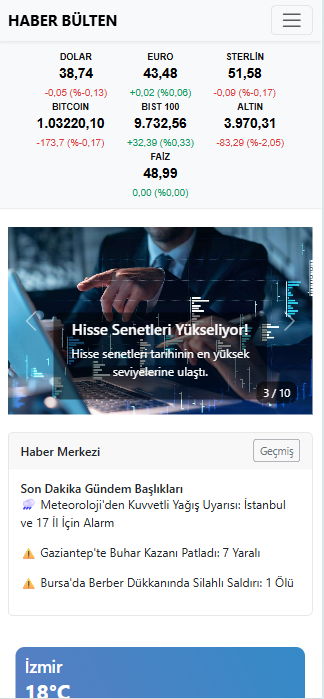

News Portal Project
🚀 Project Overview
This project is a dynamic news portal web application developed with React for the frontend. The backend is built using Node.js and the Express framework, with SQLite as the database for persistent data storage.

🛠️ Technologies Used
Frontend: React, Redux (for state management), Bootstrap, CSS
Backend: Node.js, Express.js
Database: SQLite (for persistent data storage)
Hosting: Render.com (free hosting with Node.js support)

✨ Key Features
📌 Sticky Ads: Two sticky ads appear on the left and right sides of the page, which can be closed by the user.

📌 Sticky Responsive Menu: A fixed, responsive top menu with two menu items having 3 submenus each. The Finance menu data is dynamically fetched from the backend API.

📌 News Slider: Displays 10 news headlines fetched from the backend API in a slider. Each news item links to its own detail page.

📌 Weather Data: Shows 5-day weather data retrieved from the backend API.

📌 History: Stores and displays the last 10 news headlines visited by the user using Redux.

📌 Responsive Design: All pages are fully responsive and work smoothly on different devices.

⚙️ Setup and Running
Backend:
cd backend  
npm install  
npm start 

Frontend (news-portal)
npm install  
npm start  

📌 Important Notes
The backend API fetches all data from the SQLite database; no in-memory data is used.

Finance menu, weather data, and slider news are dynamically fetched from the backend.

Ads can be easily closed to improve user experience.

The project is deployed on Render.com.
> ⚠️ Please note that the backend is hosted on [render.com](https://render.com). If the server has been inactive for more than 15 minutes, it might take a short while to wake up and respond to requests.

🔗 Live Site & Source Code
Live Site: https://news-frontend-z9qr.onrender.com/
GitHub Repository: https://github.com/ecetopuz/news-portal

## Screenshots

### Screenshot 1

### Screenshot 2

### Screenshot 3

### Screenshot 4

